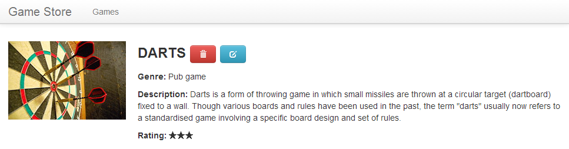
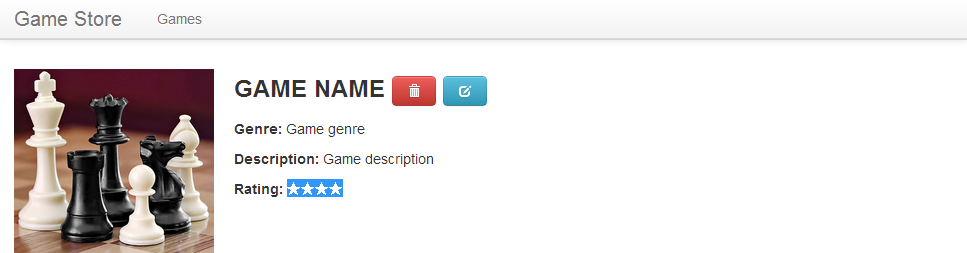
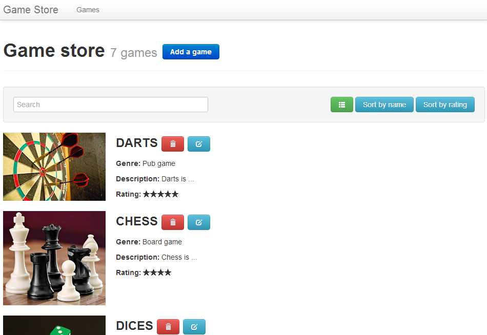
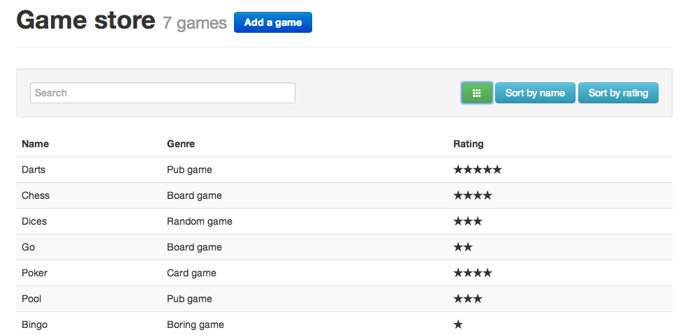

Game Store Codelab
==================

Learn how to build a webapp with Dart and Polymer.  
<!--
TODO:
- Add wiki common references for images
- Tests all links
- Publish on gh-pages branches and add a link to the template
-->
# Introduction
The goal of this codelab is to develop a game store application from a html template. Users will be able to manage the games in the store.

## Prerequisites
Before you begin this codelab, you should have the last [Dart Editor][1] Setup ready.

## User stories
This codelab is divided into the following sections:

1. [Show the content of a game](#user-story-1)
2. [Show the list of all games (detailed template)](#user-story-2)
3. [Filter and sort the games list](#user-story-3)
4. [Show the list of all games (compact template)](#user-story-4)
5. [Edit the content of an existing game](#user-story-5)
6. [Add a new game](#user-story-6)
7. [Delete a game](#user-story-7)
8. [Single-page application](#user-story-8)

## Useful links
- [A Tour of the Dart Language][2]
- [Dart API Reference][3]
- [Polymer.dart][4]
- [Polymer.dart examples][6]

# User stories

<a name="user-story-1"></a>
## 1. Show the content of a game
> **Goal**: _As a user, I want to see the content of a game_

_**Keywords**: custom element, template, binding_

1. Create a new Polymer application named `game_store_codelab` and explore it
  - Fill the _Application name_ and select _Web application (using the polymer library)_  
    
  - `pubspec.yaml` includes a new dependency
  
    ```YAML
    dependencies:
      polymer: any
    ```
  - `build.dart` is runned after a file is saved, and displays Polymer warnings from the linter
  - `clickcounter.html` and `clickcounter.dart` is a custom element named `click-counter`
  
    ```HTML
    <polymer-element name="click-counter" attributes="count">
      <template>
        <!-- Custom element body -->
      </template>
      <script type="application/dart" src="clickcounter.dart"></script>
    </polymer-element>
    ```
    
    ```Dart
    import 'package:polymer/polymer.dart';

    @CustomTag('click-counter')
    class ClickCounter extends PolymerElement {
      ClickCounter.created() : super.created();
      // ...
    }
    ```
  - `game_store_codelab.html` imports `click-counter` element to used it and initializes Dart and Polymer
  
    ```HTML
    <head>
      <!-- import the click-counter -->
      <link rel="import" href="clickcounter.html">
      <script type="application/dart">export 'package:polymer/init.dart';</script>
      <script src="packages/browser/dart.js"></script>
    </head>
    
    <body>   
      <click-counter count="5"></click-counter>
    </body>
    ```

2. Copy all files from the _[template](./template)_ folder into the _web_ directory of your project
3. Create a new custom element `x-game`
  - Create `game.html` and `game.dart` files taking `click-counter` element as an example
  - Copy the `GAME_TEMPLATE` html blocks from the templates into the body of your custom element
  - Import and use it in your `index.html` file

    ```HTML
    <section class="container">
      <x-game></x-game>
    </section>
    ```
  - Run `index.html` in Dartium and you should see something like this ([Hints](#user-story-1-hints)):  
    
4. Congrats! You created your first custom element! But it's all static, let's do some data bindings :)
  - Create a file `models.dart` with the class `Game`:
    ```Dart
    library game_store.model;
    
    class Game {
      int id;
      String name;
      String genre;
      String description;
      String image;
      int rating;
      
      // Constructors
      Game(this.id, this.name, this.genre, this.description, this.image, this.rating);
      Game.sample() : this(null, "Game name", "Game genre", "Game description", "chess.jpg", 4);
    }
    ```
  - Add a `game` attribute in the `x-game` class:

    ```Dart
    import 'package:polymer/polymer.dart';
    import 'models.dart';
    
    @CustomTag('x-game')
    class XGame extends PolymerElement {
      Game game = new Game.sample();
      // ...
    }
    ```
  - Bind `game` fields into the `x-game` template ([Hints](#user-story-1-hints)):
    - Game name should be uppercased
    - Rating should be transformed into &#9733; characters (`"\u2605"`)

    

<a name="user-story-1-hints"></a>
> **Hints:**
> 
> - Don't forget to add needed tags in `index.html` header
> - To apply styles from the document to the contents of a custom element, add this getter in its dart class: `bool get applyAuthorStyles => true;`
> - Use a filter function to uppercase the game name, defined in the custom element class (See [Polymer expressions][5])
> - Use also a filter function to transform the rating integer to &#9733; characters (See [List.generate](https://api.dartlang.org/docs/channels/stable/latest/dart_core/List.html#generate) and [List.join](https://api.dartlang.org/docs/channels/stable/latest/dart_core/List.html#join))

<a name="user-story-2"></a>
## 2. Show the list of all games (detailed template)
> **Goal**: _As a user, I want to see the list of all games with a detailed template_

_**Keywords**: template loop, custom attribute, nested template_

1. Create a new custom element `x-games` 
  - Create `games.html` and `games.dart` files and copy the `GAMES_TEMPLATE`  html blocks from the templates into its body  
  _We are going to work with the `GAMES_TEMPLATE_DETAILED` in this user story so comment or remove the `GAMES_TEMPLATE_COMPACT`_
  - Import and use it in your `index.html` instead of `x-game` and check the result
2. One game is not enough for a Game Store, create a service to retrieve games
  - Create a file `services.dart` with the class `InMemoryGameStoreService`:
  
    ```Dart
    library game_store.service;
    import 'models.dart';
  
    final gameStoreService = new InMemoryGameStoreService();
  
    class InMemoryGameStoreService {
      final List<Game> _games = [
         new Game(1, "Darts", "Pub game", 'Darts is ...', "darts.jpg", 5),                    
         new Game(2, "Chess", "Board game", 'Chess is ...', "chess.jpg", 4),                    
         new Game(3, "Dices", "Random game", 'Dice are ...', "dice.jpg", 3),                    
         new Game(4, "Go", "Board game", 'Go is ...', "go.jpg", 2),
         new Game(5, "Poker", "Card game", 'Poker is ..', "poker.jpg", 4),
         new Game(6, "Pool", "Pub game", 'Pool is ..', "pool.jpg", 3),
         new Game(7, "Bingo", "Boring game", 'Bingo is ..', "bingo.jpg", 1)
      ];
      
      List<Game> getAll() => _games;
    }
    ```
  - Add a `games` attributes in `x-games` class and instantiate it with games retrieved from the service:

    ```Dart
    List<Game> games = gameStoreService.getAll();
    ```    
3. Iterate over the games list
  - Import `x-game` component in your `games.html` file and to be able to reused it.
  - Loop over games using a template loop and reusing the `x-game` component like this ([Hints](#user-story-2-hints)):

    ```HTML
    <x-game game="{{game}}"></x-game>
    ```
4. Congrats! You have more games!

    
  

<a name="user-story-2-hints"></a>
> **Hints:**
>
> - Try first to display the names of the games.
> - The `game` attribute in `x-game` should be a public attribute. (See [Custom Attributes](https://www.dartlang.org/polymer-dart/#custom-attributes))

<a name="user-story-3"></a>
## 3. Filter and sort the games list
> **Goal**: _As a user, I want to filter and sort the games list_

<a name="user-story-4"></a>
## 4. Show the list of all games (compact template)
> **Goal**: _As a user, I want to see the list of all games with an alternative compact template_

_**Keywords**: Template conditionals_

1. Modify `x-games` to deal with compact view 
  - Add a observable boolean field `isCompact` in `game.dart`
  - Use a template condition to display full view when `isCompact` is false. ([Hint](https://www.dartlang.org/polymer-dart/#template-conditionals)]).
  - Copy `GAMES_TEMPLATE_COMPACT` template and display it when `isCompact` is true. ([Hints](#user-story-3-hints))
  
2. Manage the change of view.  
  - In `games.dart`, add a toggle method to change `isCompact` value :
  ```Dart
  compact(Event e, var detail, Element target) => isCompact = !isCompact;
  ```
  - In `games.html`, call the `compact` method when the user click on switch view button.
  - Change the button class to depends on `isCompact` value :
  
  ```HTML
  class="icon-white {{ {'icon-th-list' : !isCompact , 'icon-th' : isCompact } }}
  ```
  
3. Great ! Needless to scroll down to see all your games
 

 
<a name="user-story-4-hints"></a>
> **Hints:** 
> The condition template does not support else, so do not hesitate to use two if conditions.

<a name="user-story-5"></a>
## 5. Edit the content of an existing game
> **Goal**: _As a user, I want to edit the content of an existing game_

<a name="user-story-6"></a>
## 6. Add a new game
> **Goal**: _As a user, I want to add a new game_

<a name="user-story-7"></a>
## 7. Delete a game
> **Goal**: _As a user, I want to delete a game_

<a name="user-story-8"></a>
## 8. Single-page application
> **Goal**: _As a user, I want to navigate through pages without reloading the application._

# Summary
Congratulations, you've completed this codelab and have created a single page application with Dart and Polymer.

_Thanks to Thierry Lau for his AngularJS project [AngularMovie](https://github.com/lauterry/angularmovie) on which we take as example._

  [1]: https://www.dartlang.org/
  [2]: https://www.dartlang.org/docs/dart-up-and-running/contents/ch02.html
  [3]: http://api.dartlang.org/docs/channels/stable/latest/
  [4]: https://www.dartlang.org/polymer-dart/
  [5]: http://pub.dartlang.org/packages/polymer_expressions
  [6]: https://github.com/sethladd/dart-polymer-dart-examples/tree/master/web
