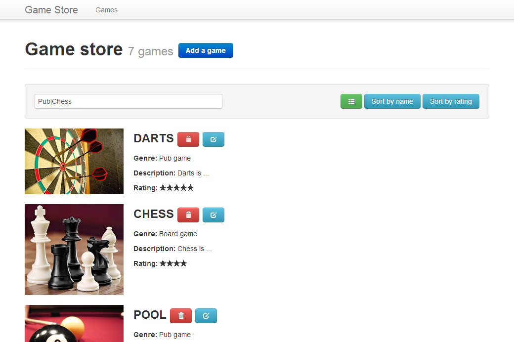

## 3. Filter and sort the games list
> **Goal**: _As a user, I want to filter and sort the games list_

_**Keywords**: two-way databinding, observable, event handler_

1. In `models.dart` add those methods to the `Game` class. They will help you for filter and sort.

    ```Dart
    // Used for FILTERING
    bool contains(String search) {
      var pattern = new RegExp(search, caseSensitive: false);
      return name.contains(pattern) || genre.contains(pattern) || description.contains(pattern);
    }
    
    // Used for SORTING
    static getComparator(String field) => _comparators.containsKey(field) ? _comparators[field] : (a, b) => 0;
    static final Map _comparators = {
      "name": (Game a, Game b) => a.name.compareTo(b.name),
      "rating": (Game a, Game b) => a.rating.compareTo(b.rating)
    };
    ```
2. Filter the game list when typing text in search input
    - Add a `search` attribute in `games.dart` and bind it to the search input value ([Hints](#user-story-3-hints))
    - Implement a filter function `filterSearch` that allows to filter a games sequence and use it in the template loop binding ([Hints](#user-story-3-hints)):
    ```HTML
    <template repeat="{{game in games | filterSearch(search)}}">
    ```
3. Sort games list when clicking on _Sort by name_ or _Sort by rating_ buttons
  - In `games.html`, bind click events to `sort` handler

    ```HTML
    <button class="btn btn-info" on-click="{{sort}}" data-field="name">Sort by name</button>
    <button class="btn btn-info" on-click="{{sort}}" data-field="rating">Sort by rating</button>
    ```
  - In `games.dart`, implement the click handler `sort` that sets two new fields `sortField` and `sortAscending`
    - `sortField` is set from the `data-field` attribute in the target element ([Hints](#user-story-3-hints))
    - `sortAscending` is reversed each time a button is clicked
  - Implement a filter function `sortBy` that sorts a games sequence and use it in the template loop binding ([Hints](#user-story-3-hints)):

    ```HTML
    <template repeat="{{game in games | filterSearch(search) | sortBy(sortField, sortAscending)}}">
    ```
4. Try to sort and filter the games  
    

<a name="user-story-3-hints"></a>
> **Hints:**
>
> - In this user story, attributes must be **Observable**, when the value changed, bindings are notified (See [Data binding](https://www.dartlang.org/polymer-dart/#data-binding))
> - Dynamic filter function with bound parameters must return a filter function Oo
>
>   ```Dart
>   dynamicFilterFunction(param1, param2) {
>     return (Iterable games) {
>       // ...
>     };
>   }
>   ```
> - An event handler is a three parameter methods defined in the custom element class (See  [Event Handlers](https://www.dartlang.org/docs/tutorials/polymer-intro/#event-handlers))  
>   `myEventHandler(Event e, var detail, Element target)`
>   - An `Event` that contains information about the event, such as its type and when it occurred.
>   - The detail object can provide additional, event-specific information.
>   - The `Element` that fired the event.
> - [Element.dataset](https://api.dartlang.org/docs/channels/stable/latest/dart_html/Element.html#dataset) allows access to all custom data attributes (data-*) set on this element.
> - [List](https://api.dartlang.org/docs/channels/stable/latest/dart_core/List.html) and [Iterable](https://api.dartlang.org/docs/channels/stable/latest/dart_core/Iterable.html) methods are your friends ;)

## [Next >](user-story-4.md)
