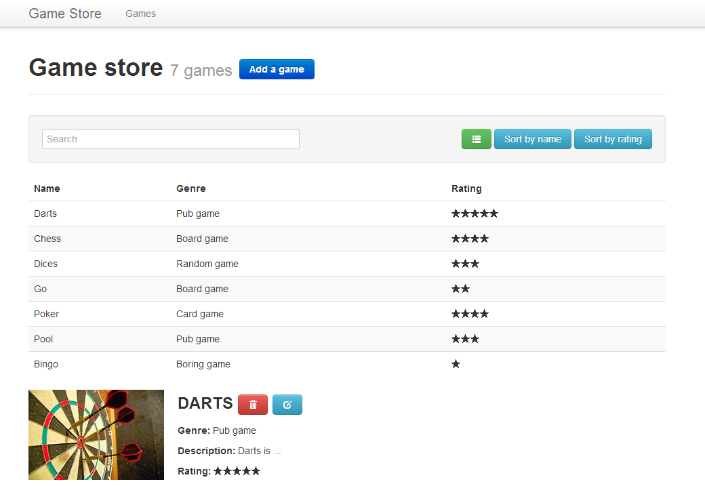

## 4. Show the list of all games (compact template)
> **Goal**: _As a user, I want to see the list of all games with an alternative compact template_

_**Keywords**: conditional template_

1. Display compact template in games list
  - In `games.html`, add [`GAMES_TEMPLATE_COMPACT`][GAMES_TEMPLATE_COMPACT] HTML blocks
  - Recreate a template loop for it and bind game fields  
    
2. Switch between templates
  - In `games.dart`, add an observable field `isCompact`

    ```Dart
    @observable bool isCompact = false;
    ```
  - Add a click handler on the toggle button to reverse the value of `isCompact`

    ```Dart
    compact(Event e, var detail, Element target) => isCompact = !isCompact;
    ```
  - In `games.html`, use conditional templates to display the right template ([Hints](#hints))
    - [`GAMES_TEMPLATE_COMPACT`][GAMES_TEMPLATE_COMPACT] when `isCompact` is `true`
    - [`GAMES_TEMPLATE_DETAILED`][GAMES_TEMPLATE_DETAILED] when `isCompact` is `false`

3. Great! Needless to scroll down to see all your games  
  

<a name="hints"></a>
> **Hints:**
> 
> - See [Template conditionals](https://www.dartlang.org/polymer-dart/#template-conditionals)
>
> **Bonus:** 
> 
> - Switch the toggle button class between `icon-th-list` and `icon-th` in function of `isCompact` value

## [Next >](user-story-5.md)

  [GAME_TEMPLATE]: ../../blob/master/template/index.html#L33-L46
  [GAMES_TEMPLATE]: ../../blob/master/template/index.html#L50-L136
  [GAMES_TEMPLATE_DETAILED]: ../../blob/master/template/index.html#L67-L106
  [GAMES_TEMPLATE_COMPACT]: ../../blob/master/template/index.html#L108-L135
  [GAME_EDIT_TEMPLATE]: ../../blob/master/template/index.html#L140-L170  
