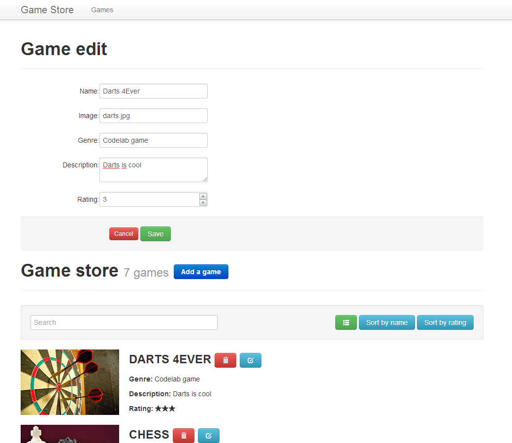

## 5. Edit the content of an existing game
> **Goal**: _As a user, I want to edit the content of an existing game_

_**Keywords**: two-way databinding, two-way filter_

1. Create a new custom element `x-game-edit`
  - Create `game-edit.html` and `game-edit.dart` files and copy the `GAME_EDIT_TEMPLATE` html blocks from the templates into its body  
  - Import and use it in `index.html`:

    ```HTML
    <x-game-edit gameId="1"></x-game-edit>
    <x-games></x-games>
    ```
2. Retrieve the game to edit
  - In `service.dart`, implement the `getById` method that returns the game for the given id:

    ```Dart
    Game getById(int id) => ???;
    ```
  - In `game-edit.dart`, add a public attribute `gameId` and an observable `game` attribute:

    ```Dart
    @published int gameId = null;
    @observable Game game = new Game.sample();
    ```
  - Retrieve the game to edit when the `gameId` attribute change ([Hints](#hints))
    - if `gameId` is null, set `game` with `new Game.sample()`
    - else set `game` with the retrieved game
3. Bind `game` fields to edit them
  - In `game-edit.html`, bind `game` fields to input values ([Hints](#hints))  
    _When editing the game, the values should dynamically change in the games list below_
  - Check the DartEditor console when editing the rating. Fix the error ([Hints](#hints))
4. Enjoy the powerful of databinding!
    

<a name="hints"></a>
> **Hints:**
>
> - Use [onPropertyChange](https://api.dartlang.org/docs/channels/be/latest/observe.html#onPropertyChange) to execute a function when an observable property change
> - Remember what to do to notify bindings when value changed
> - To create a two-way filter, implement a `Transformer` class (No docs :( see [Bind number to text field with filter  example](https://github.com/sethladd/dart-polymer-dart-examples/tree/master/web/bind_number_to_text_field_with_filter))

## [Next >](user-story-6.md)
