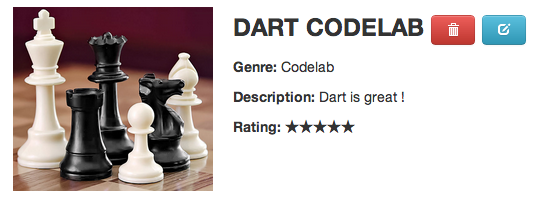

## 6. Add a new game
> **Goal**: _As a user, I want to add a new game_

1. Implement `save` in `services.dart` ([Hints](#hints))

  ```Dart
  Game save(Game game) {
    // Add to the list when it's a new game
    // Replace the existing one when it already exists
  }
  ```
2. Update `x-game-edit` web component
  - Add a `save` event handler which call `save` method in `gameStoreService`.
  - Call this method when the user click on save button.
3. Update `index.html`, remove the `gameId` attribute and try to save

  ```HTML
  <x-game-edit></x-game-edit>
  ```
4. Yeah! So many games to add!  
  
 
 
<a name="hints"></a>
> **Hints:** 
> You must set the id for a new game. Use [List.map](https://api.dartlang.org/docs/channels/stable/latest/dart_core/List.html#map), [List.fold](https://api.dartlang.org/docs/channels/stable/latest/dart_core/List.html#fold) and [max](https://api.dartlang.org/docs/channels/stable/latest/dart_math.html#max) to find the highest game id.

## [Next >](user-story-7.md)
