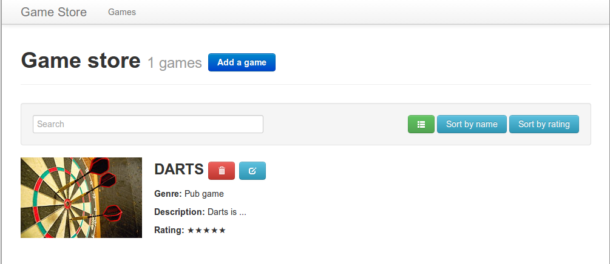

## 7. Delete a game
> **Goal**: _As a user, I want to delete a game_

_**Keywords**: custom event_

1. Implement `delete` in `services.dart`

  ```Dart
  delete(int id) => ???;
  ```
2. Fire a custom event on trash button click
  - In `x-game` element, handle click on trash button
  - Fire a custom event `my-delete-event` embedding the game instance ([Hints](#hints))
3. Handle the custom event
  - In `x-games` element, handle `my-delete-event` from the `x-game` element
  - Implement the handler to delete the game using `gameStoreService`
4. One Game to rule them all!  
  


<a name="hints"></a>
> **Hints:**
>
> - Use [dispatchEvent](https://api.dartlang.org/docs/channels/stable/latest/dart_html/EventTarget.html#dispatchEvent) and [CustomEvent](https://api.dartlang.org/docs/channels/stable/latest/dart_html/CustomEvent.html)


## [Next >](user-story-8.md)
