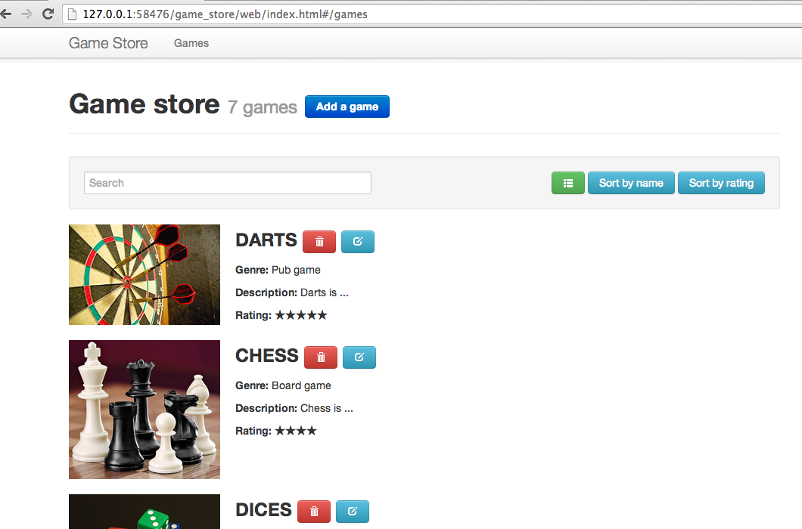

## 8. Single-page application
> **Goal**: _As a user, I want to navigate through pages without reloading the application._

_**Keywords**: router, url pattern, handler_

1. Add `route` dependency un `pubspec.yaml`

2. Create a new custom element `x-route` ([Hint](#user-story-8-hints))
  - Create `route.html` and `route.dart` files
  - In `route.dart`, define 3 patterns to recognize urls like this :
    - `#/games` : list all games
    - `#/game/1` : show game with id=1
    - `#/games/new` : create a new game
  - Create handler for eaches.  
  - Create a router.  
  - In `route.html`, create 2 templates conditions according to url : one to display `x-games`, the other for `x-game-edit`.  
  
3. In `index.html`, use `x-route` instead of `x-game-edit` and `x-games`.

4. Now you can bookmark your games list !

> **Hints:**
>
> - Read sample of [Client routing](http://pub.dartlang.org/packages/route)
> - You need to create a `Route` class that wrap `UrlPattern` and url params list.
> - Implements operator [] in `Route` to help you to find paramater at index position. 

## [End >](end.md)

